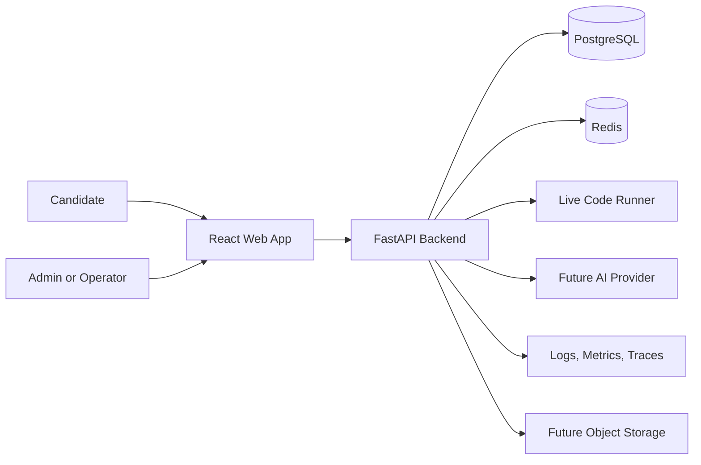
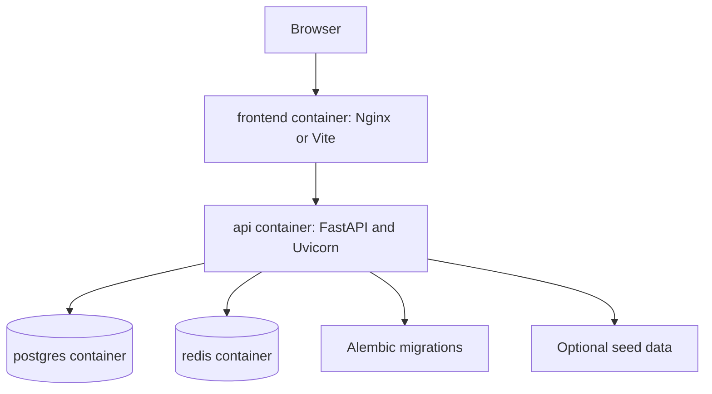
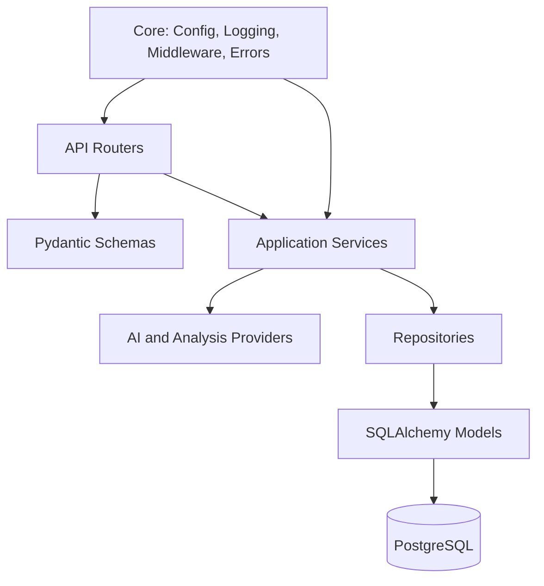
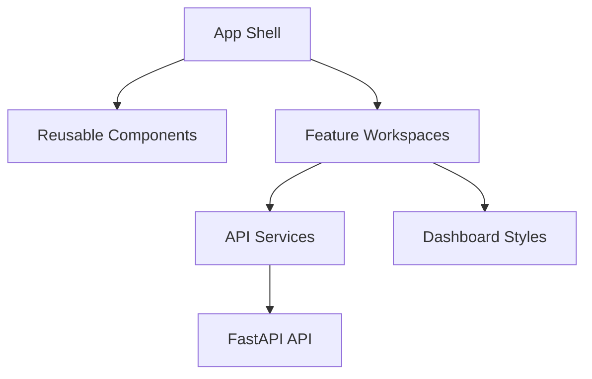
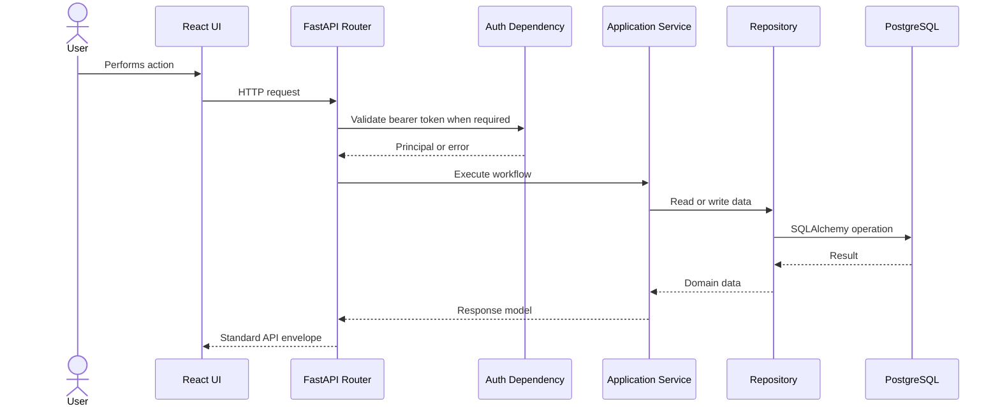
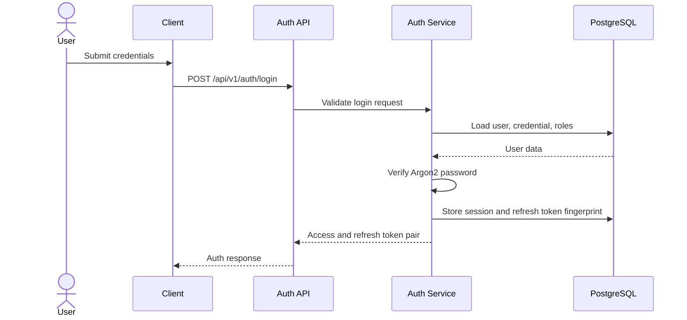
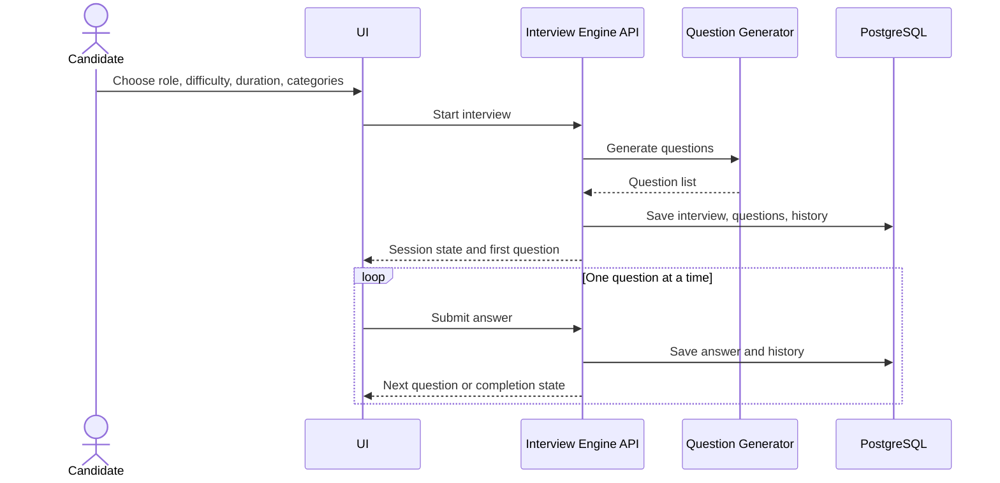
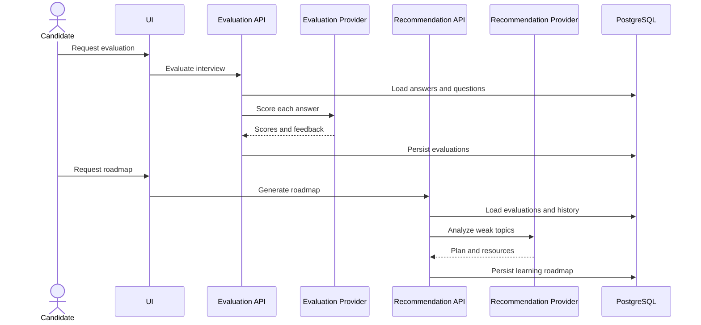
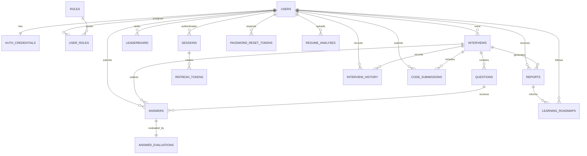

# OfferPilot AI Architecture

OfferPilot AI follows a modular product architecture with clear separation between frontend experience, backend application services, persistence, runtime infrastructure, and future AI provider integrations.

## Architecture Goals

- Keep product modules independently testable and replaceable.
- Isolate business workflows in services rather than route handlers.
- Use repositories for database access and SQLAlchemy models for persistence.
- Keep AI generation and analysis behind provider interfaces.
- Support local development and production deployment through Docker.
- Preserve a path toward managed Postgres, managed Redis, external AI providers, workers, and observability.

## System Context

## Container Topology

## Backend Layering

## Frontend Layering

## Domain Modules

| Module | Responsibility |
| --- | --- |
| Authentication | Signup, login, logout, refresh tokens, reset password, roles, sessions, user profile |
| Interview Engine | Timed interviews, generated questions, current-question sequence, answer storage |
| AI Evaluation | Per-answer scoring, model answers, suggestions, related topics, difficulty analysis |
| Learning Recommendations | Weak topic detection, resource suggestions, daily, weekly, monthly roadmaps |
| Analytics | Topic accuracy, progress, heat maps, radar charts, trends, interview history |
| Live Coding | Run code, analyze code, complexity estimation, bug detection, optimized code |
| Resume Analyzer | PDF/text analysis, skills, missing skills, ATS score, questions, gap report |
| CRUD Resources | Users, interviews, questions, answers, reports, roadmaps, leaderboard, sessions, history |

## Request Lifecycle

## Authentication Flow

## Interview Engine Flow

## Evaluation and Recommendation Flow

## Database ER Diagram

## Runtime Configuration

Configuration is environment-driven through `OFFERPILOT_AI_` variables. The application uses typed settings, explicit environment modes, CORS allowlists, trusted-host checks, request IDs, health checks, and structured logging.

## Production Architecture Direction

The Docker Compose stack is production-capable for small deployments and preview environments. Larger deployments should move toward:

- Managed PostgreSQL.
- Managed Redis.
- CDN and TLS termination at the edge.
- Separate worker services for heavy AI, PDF, and code execution tasks.
- Centralized logs, metrics, traces, and alerting.
- Object storage for resume files and generated artifacts.
