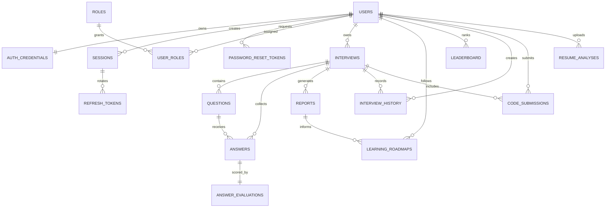

# OfferPilot AI Database

OfferPilot AI uses PostgreSQL as the primary system of record. SQLAlchemy models define the application schema, and Alembic migrations manage schema evolution.

## Database Technology

| Item | Choice |
| --- | --- |
| Database | PostgreSQL |
| ORM | SQLAlchemy async ORM |
| Driver | asyncpg |
| Migration tool | Alembic |
| Structured flexible fields | PostgreSQL JSONB |
| Local container | `postgres:16-alpine` |

## Core Tables

| Table | Purpose |
| --- | --- |
| `users` | User profile and account status |
| `auth_credentials` | Argon2 password hash and credential status |
| `roles` | System and custom roles |
| `user_roles` | User to role assignments |
| `sessions` | Authenticated user sessions |
| `refresh_tokens` | Refresh token fingerprints and rotation metadata |
| `password_reset_tokens` | Password reset token fingerprints and lifecycle |
| `interviews` | Interview sessions and score snapshots |
| `questions` | Generated or catalog questions |
| `answers` | Candidate answer transcripts |
| `answer_evaluations` | AI-generated answer scores and feedback |
| `reports` | Interview performance reports |
| `learning_roadmaps` | Personalized recommendation plans |
| `leaderboard` | Ranking and progress entries |
| `interview_history` | Append-only interview lifecycle events |
| `code_submissions` | Live coding source, output, analysis, and optimization data |
| `resume_analyses` | Resume extraction, ATS score, gaps, and generated questions |

## Relationship Diagram



## Table Notes

### Users and Authentication

- `users.email` is unique and indexed.
- `auth_credentials.user_id` is unique and cascades on user deletion.
- Refresh and reset tokens are stored as fingerprints, not plaintext values.
- Roles are normalized through `roles` and `user_roles`.

### Interviews and Answers

- `interviews` owns generated questions, answers, reports, and history.
- `questions.interview_id` is nullable to support catalog-style questions.
- `answers` links user, interview, and question.
- `interview_history` stores lifecycle events such as created, started, answer submitted, and completed.

### Evaluations and Recommendations

- `answer_evaluations.answer_id` is unique so each answer has one canonical evaluation unless regenerated.
- Score dimensions use numeric precision suitable for percentage values.
- `learning_roadmaps` uses JSONB for flexible recommendation content, including problem lists, courses, videos, and roadmap plans.

### Live Coding

- `code_submissions` stores source code, language, stdin, expected output, run status, stdout, stderr, complexity analysis, bugs, optimized code, and metadata.
- `interview_id` is optional to support standalone practice.

### Resume Analyzer

- `resume_analyses` stores extracted text, job description, matched skills, missing skills, ATS score, generated questions, skill gap report, and metadata.
- Resume file storage is represented by metadata today. Future production deployments should move original files to object storage.

## Alembic Migrations

Migration files live in `backend/migrations/versions`.

Current chain:

| Revision | Purpose |
| --- | --- |
| `0001_initial_schema` | Initial product schema |
| `0002_auth` | Authentication and authorization schema |
| `0003_evaluations` | Answer evaluations |
| `0004_recommendations` | Learning recommendation expansion |
| `0005_live_coding` | Live coding submissions |
| `0006_resume` | Resume analyzer |

Run migrations:

```bash
alembic -c backend/alembic.ini upgrade head
```

## Seed Data

Seed script:

```bash
python backend/scripts/seed_data.py
```

Seed data includes:

- Demo user.
- User and admin roles.
- Auth credential for local login.
- Completed interview, question, answer, report, roadmap, leaderboard entry, session, refresh token.
- Live coding submission.
- Resume analysis.
- Interview history event.

## Backup Guidance

Production deployments should use:

- Automated daily backups.
- Point-in-time recovery.
- Pre-migration snapshots.
- Backup restore drills.
- Separate retention policies for production, staging, and analytics exports.
