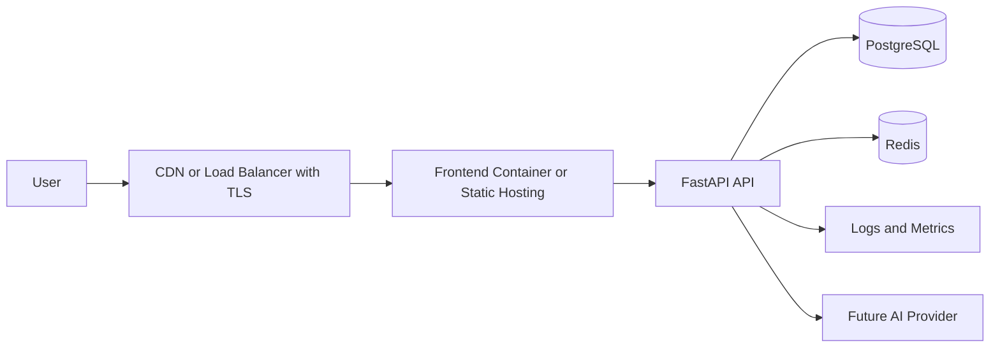

# OfferPilot AI Deployment

This document describes production deployment for OfferPilot AI, including Docker images, environment configuration, migrations, release checks, and operational expectations.

## Deployment Goals

- Build immutable API and frontend images.
- Run schema migrations before serving production traffic.
- Keep secrets outside source control.
- Terminate TLS at a trusted edge layer.
- Use health checks for API, frontend, Postgres, and Redis.
- Preserve a path to managed data services and horizontal scaling.

## Runtime Services

| Service | Image Source | Responsibility |
| --- | --- | --- |
| `frontend` | `frontend/Dockerfile` | Nginx static frontend, SPA fallback, API proxy |
| `api` | `backend/Dockerfile` | FastAPI application, migrations, optional seed execution |
| `postgres` | `postgres:16-alpine` | Relational persistence for local or small deployments |
| `redis` | `redis:7-alpine` | Cache and future job coordination |

## Production Topology



## Production Environment Setup

Create a production env file:

```bash
cp config/env/production.env.example config/env/production.env
```

Replace every placeholder:

- `POSTGRES_PASSWORD`
- `OFFERPILOT_AI_DATABASE_URL`
- `OFFERPILOT_AI_JWT_SECRET_KEY`
- `OFFERPILOT_AI_CORS_ORIGINS`
- `OFFERPILOT_AI_TRUSTED_HOSTS`
- domain names
- image tags if using a registry

Production placeholders are intentionally rejected by `scripts/deploy.sh`.

## One-Command Production Deployment

```bash
./scripts/deploy.sh config/env/production.env
```

The script performs:

1. Production image build.
2. Alembic migration to `head`.
3. Detached stack startup.

## Manual Production Commands

```bash
export OFFERPILOT_AI_ENV_FILE=./config/env/production.env
docker compose --env-file config/env/production.env -f docker-compose.yml -f docker-compose.prod.yml build
docker compose --env-file config/env/production.env -f docker-compose.yml -f docker-compose.prod.yml run --rm --entrypoint alembic api -c alembic.ini upgrade head
docker compose --env-file config/env/production.env -f docker-compose.yml -f docker-compose.prod.yml up -d
```

## Health Checks

| Check | Endpoint or Command |
| --- | --- |
| API liveness | `GET /api/v1/health/live` |
| API readiness | `GET /api/v1/health/ready` |
| Frontend liveness | `GET /health` on frontend container |
| Postgres | `pg_isready` |
| Redis | `redis-cli ping` |

## Release Checklist

- Backend tests pass: `.venv/bin/python tests/run_reports.py`.
- Frontend build passes: `npm run build` inside `frontend/`.
- Docker Compose dev and prod configs render successfully.
- Production images build successfully.
- Production env file contains no placeholder secrets.
- Migrations run successfully on staging before production.
- Backup and rollback plan is confirmed.
- Observability dashboards and alerts are active.

## Rollback Strategy

- Keep previous image tags available.
- Back up the database before destructive migrations.
- Prefer backward-compatible migrations.
- Roll back application image first when possible.
- Roll back schema only when a tested downgrade exists.

## Managed Services

For production scale, replace bundled containers with:

- Managed PostgreSQL with backups, PITR, and encryption.
- Managed Redis or equivalent cache service.
- CDN or static hosting for frontend assets.
- Centralized logging and metrics.
- Secrets manager for runtime configuration.

## Seed Data Policy

Seed data is for development and preview environments only.

Production should use:

```env
OFFERPILOT_AI_RUN_SEED=false
```

## TLS and Domains

The bundled Nginx frontend is designed to sit behind a TLS-terminating reverse proxy, CDN, or load balancer. Configure `OFFERPILOT_AI_CORS_ORIGINS` and `OFFERPILOT_AI_TRUSTED_HOSTS` to match the public production domains.
